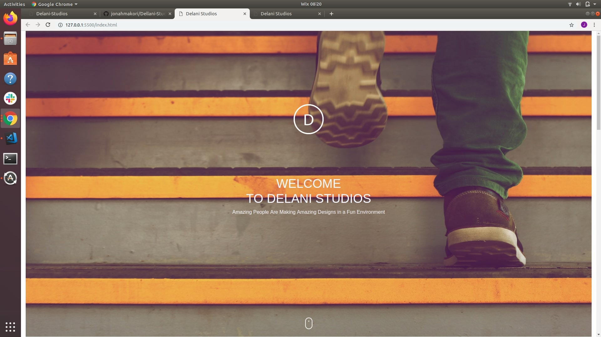

# Table of Contents
- Project Title
- Description
- Deployment
- BDD (Behaviour Driven Development)
- Project Screenshot
- Technologies used
- Acknowledgement
- Licence
- Contacts
- Author
# DELANI STUDIOS
# DESCRIPTION
- The website was based on the skills of the recreation of the alredy created one ,Whereby on submitt it was supposed to give you a feedback. 
## Deployment    
- To view the website directly<a href="https://jonahmakori.github.io/Dellani-Studios/"><i>Click Here</i></a>
- To view the code on github <a href="https://github.com/jonahmakori/Dellani-Studios"><i>Click Here</i></a>
# BDD
<ul>
<li>The project</li>
- Mainly about recreation of an already creted website
<li>The Home Page</li>
- It has a mouse icon - On click it scrolls to the about us page.
- also has a bouncing effect
<li>What We Do</li>
- On clicking the icons it displays the respective description
<li>Portfolio</li>
- On clicking the images it displays the infomation about the project 
<li>Conatact Us </li>
- On the <b>input</b> fill in the form and submitt
- On the <b>output</b> "Thank you for being our client ,Your message has been received"
</ul>

## Project Screenshot
- The landing page & Fill out form 

## Technologies Used
- Javascript
- Bootsrap
- HTML 5
- CSS 3
- jquery
## Acknowledgement
- I would like to thank the following for their             assistance through out this project.
<ol>
  <li>God Almighty</li>
  <li>Moringas' Support</li>
  <li>My collegue <i>Langat Justus</i></li>
</ol>

## Licence
    The MIT License (MIT)

    Permission is hereby granted, free of charge, to any person obtaining a copy of this software and associated documentation files (the "Software"), to deal in the Software without restriction, including without limitation the rights to use, copy, modify, merge, publish, distribute, sublicense, and/or sell copies of the Software, and to permit persons to whom the Software is furnished to do so, subject to the following conditions:

    The above copyright notice and this permission notice shall be included in all copies or substantial portions of the Software.

    THE SOFTWARE IS PROVIDED "AS IS", WITHOUT WARRANTY OF ANY KIND, EXPRESS OR IMPLIED, INCLUDING BUT NOT LIMITED TO THE WARRANTIES OF MERCHANTABILITY, FITNESS FOR A PARTICULAR PURPOSE AND NONINFRINGEMENT. IN NO EVENT SHALL THE AUTHORS OR COPYRIGHT HOLDERS BE LIABLE FOR ANY CLAIM, DAMAGES OR OTHER LIABILITY, WHETHER IN AN ACTION OF CONTRACT, TORT OR OTHERWISE, ARISING FROM, OUT OF OR IN CONNECTION WITH THE SOFTWARE OR THE USE OR OTHER DEALINGS IN THE SOFTWARE.

    Copyright (c) 2019 Jonah Makori.

## Contacts
    At emergence of any inquerries reach me through the following:
    jonahmakori0@gmail.com
    0700222621
## Author
    Jonah Makori

